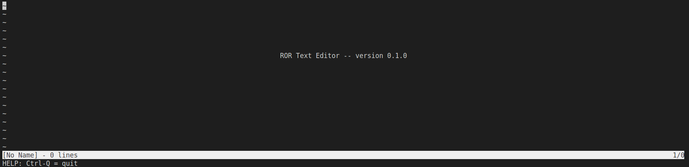

# ROR_TextEditor
A terminal text editor.


## Project structure
This is a simple project, Just be a Rust exercise:)
```
./
├── Cargo.lock
├── Cargo.toml
├── README.md
└── src
    ├── main.rs
    └── modules
        ├── document.rs
        ├── rorlib.rs
        ├── row.rs
        └── terminal.rs
```
Cargo.toml includes some libraries we need to use, version information, etc.    
main.rs is the main file.It determines what is executed when the program starts.The specific implementation code is in the modules file.    
I abstracted the process of program startup into the run() function of modules/rorlib.rs. The specific implementation of documents, terminal operations, etc. is in other files of modules, and abstracted into corresponding functions in rorlib.rs

## Install on your Linux
```
sudo su
```
Download rortext.tar from http://anan.i234.me:7777/ror/list.html . Put it in the directory you want to install, for example:
```
/home/makiror/ror/rortext.tar
```
unzip it:
```
tar xvf rortext.tar
```
You will see a directory like this
```
ls
build  deps  examples  incremental  ror  ror.d  set.sh
```
Run set.sh to set environment variables:
```
./set.sh
or
bash ./set.sh
```
try to start it when done.If successful you will see a screen like this
```
ror [filename]
```


## How to use(v0.1.0)

### Move
You can use the arrow keys to move the cursor.

### Hot key
```
Ctrl+s: Save, if the filename is empty, it will let you type
Ctrl+q: Quit program, press three times to force quit without saving
Ctrl+d: Command board
```

### Command
```
Esc:exit find mode
Right or Down:go to the next search result
Left or Up: go to previous search result
```

